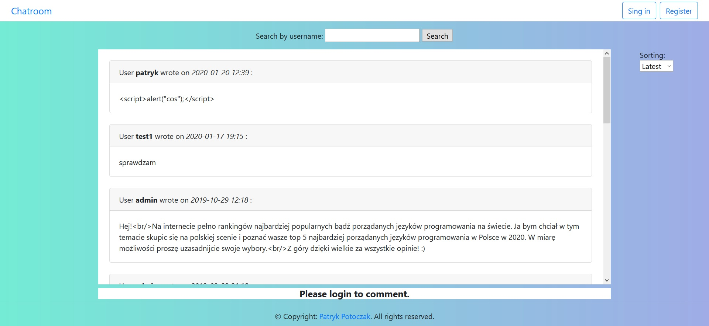
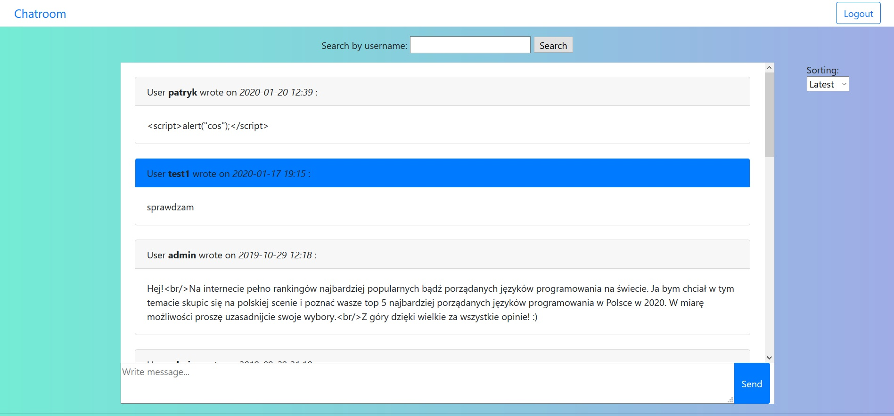

# Chatroom-Spring
> The application was created as a student project. This is a simple website that work as a simple web chat. Logged users can talk each other on various topics.

## Technologies
* Java 8
* Spring Boot
* Spring MVC
* Spring Data JPA
* Spring Security
* WebSocket (with STOMP)
* Hibernate 5
* MySQL
* Bootstrap 4
* Thymeleaf
* JUnit 5 (with Mockito)

## Screenshots

---

